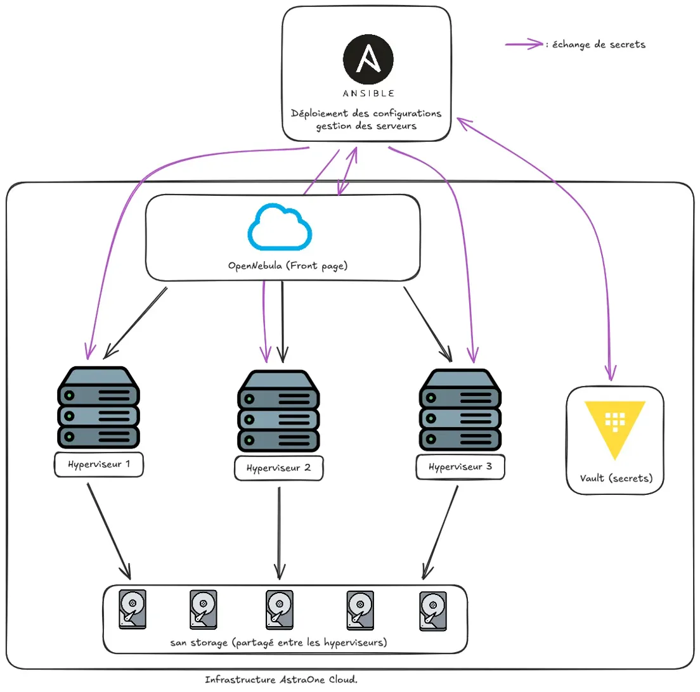

# Astra-One Cloud - Une platforme d’infrastructure cloud auto-hébergée

## Introduction

> [!WARNING]  
> La solution suivante est encore en développement et est donc expérimentale. Il est donc possible qu'il y ait des changements de configuration ou des bugs.

Astra-One Cloud est une plateforme de cloud privé sécurisé conçue pour héberger, exploiter et administrer des services internes critiques au sein d’une infrastructure totalement maîtrisée. Contrairement à une architecture distribuée dans un cloud public, Astra-One Cloud repose sur un modèle souverain : les ressources physiques, les mécanismes de virtualisation, le système d’exploitation, la segmentation réseau et la gestion des secrets sont intégralement contrôlés en interne.

La plateforme s’appuie sur une architecture virtualisée construite autour d’un hyperviseur centralisé, permettant la création de machines virtuelles isolées. Chaque composant est intégré dans une logique de cloisonnement et de séparation des responsabilités. Les secrets ne sont jamais stockés en clair et sont gérés par HashiCorp Vault. Le système d’exploitation standardisé est Rocky Linux afin d’assurer stabilité, cohérence et support à long terme.

Astra-One Cloud ne doit pas être compris comme un simple cluster de machines virtuelles. Il s’agit d’une architecture structurée selon des principes de “Security by Design”, où la sécurité est une propriété intrinsèque et non une surcouche ajoutée.

---

## Objectif :
- Se former sur les infrastructure cloud
- Mieux comprendre le fonctionnement d'un hyperviseur et de la virtualisation
- Apprendre à gérer un stockage SAN en environnement virtualisé
- Mieux maitrisé les OS linux

## Architecture

> [!IMPORTANT]  
> Par ailleurs, toutes les VM utilisées sont sous Rocky Linux 9, RHEL 10 n’étant pas encore supporté par OpenNebula.

Astra-One Cloud repose sur une architecture modulaire :

- **Frontend Node**
    - OpenNebula Core
    - Sunstone GUI
    - Base de données SQL
        
- **Hypervisor Nodes**
    - KVM    
    - Virtualisation des VM
        
- **Storage Layer**
    - Stockage SAN
        
- **Bastion**
    - Solution Vault par HashiCorp
        

---

## À suivre :

Mise en place de configurations Ansible :

- Permettant la mise en place simplifiée de l’infrastructure.
    
- Facilitant l’augmentation du nombre de nœuds back-end.
    
- Limitant les erreurs humaines lors de l’installation des machines.
    

Personnalisation de l’interface OpenNebula :

- Personnaliser davantage le projet.
    

---

## Documentation utilisée

La conception et le déploiement d’Astra-One Cloud s’appuient sur les documentations officielles suivantes :

### HashiCorp Vault

- Documentation officielle :  
    [https://developer.hashicorp.com/vault/docs](https://developer.hashicorp.com/vault/docs)
    
- Guides de déploiement :  
    [https://developer.hashicorp.com/vault/tutorials](https://developer.hashicorp.com/vault/tutorials)
    
- Architecture & Security Model :  
    [https://developer.hashicorp.com/vault/docs/internals](https://developer.hashicorp.com/vault/docs/internals)
    

---

### Rocky Linux

Système d’exploitation pour les nœuds Frontend, Hyperviseurs, Vault et San.

- Documentation officielle :  
	[https://docs.rockylinux.org/](https://docs.rockylinux.org/)

---
### OpenNebula

- Documentation officielle :  
	[https://opennebula.io/](https://opennebula.io/)
